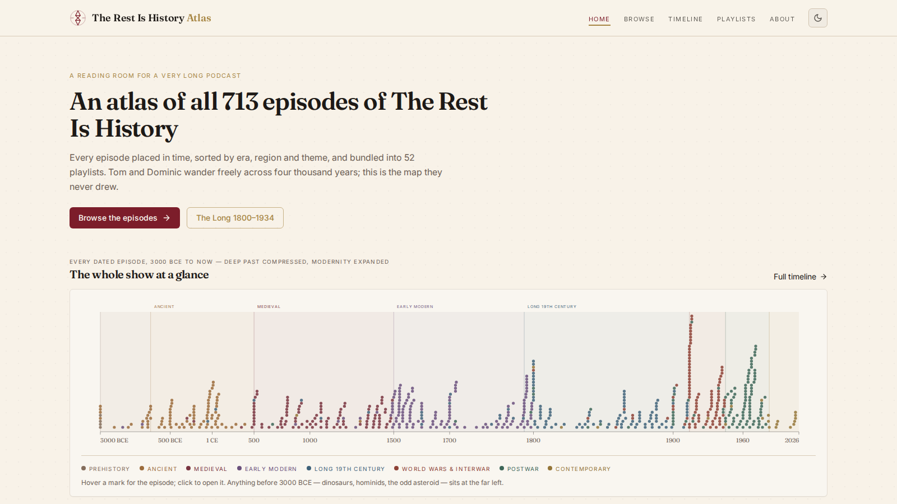

# The Rest Is History — Sorting

An end-to-end pipeline that reads every episode of the podcast **The Rest Is History**, tags each one with the primary historical period + region + themes, groups episodes into 52 thematic playlists, and exposes the whole thing through an interactive web app called **The Rest Is History Atlas**.

- **713 episodes** from the public RSS feed (2020-10-28 → 2026-08-02)
- **655 tagged with dated ranges**; 58 flagged as undated / meta
- **52 curated playlists** across era, region, theme, and cross-cutting cohorts
- **141 episodes** in the signature 1800–1934 filter
- **98 multi-part series** detected and grouped



Live preview: attached in the conversation. Deploys to Railway via the config in `app/railway.json`.

---

## Repo layout

```
.
├── data/                      # Final tagged datasets — the shippable outputs
│   ├── episodes.jsonl         # 713 rows, EXACT schema from the original prompt
│   ├── episodes_extended.jsonl# All fields, incl. era_bucket, themes, key_figures, series
│   ├── episodes.csv           # Same rows, spreadsheet-friendly
│   ├── playlists.json         # 52 playlists with episode_guids in chronological order
│   └── stats.json             # Roll-up counts for the landing page
│
├── pipeline/                  # Reproducible pipeline (Python)
│   ├── parse_feed.py          # Megaphone RSS → normalized JSONL
│   ├── tag_episodes.py        # LLM-tag each episode (start/end year, region, era, themes, ...)
│   ├── postprocess.py         # Detect series, build playlists, compute Spotify/Apple links
│   ├── export_deliverables.py # Emit CSV + original-schema JSONL
│   └── inspect_tags.py        # Sanity checks / QA prints
│
├── app/                       # The Rest Is History Atlas — Express + Vite + React web app
│   ├── client/                # React front-end (wouter, TanStack Query, Tailwind, shadcn/ui)
│   ├── server/                # Express — static passthrough only (no persistent state)
│   ├── shared/                # Types shared between client and server
│   ├── railway.json           # Railway build + start config
│   └── package.json
│
└── screenshots/               # QA screenshots (desktop, dark, mobile)
```

---

## The tagger

Each episode was tagged against this fixed vocabulary:

| Field | Values |
|---|---|
| `primary_start_year` / `primary_end_year` | integers, negative = BCE, 0 = undated |
| `primary_region` | Britain, United States, France, Germany, Italy, Russia, China, India, Middle East, Mediterranean, Latin America, Africa, Global, Europe, Eastern Europe, Ireland, Japan, Scandinavia, Byzantine, Ancient Near East, Undated, … |
| `era_bucket` | Prehistory (< -3000), Ancient (-3000 → 500), Medieval (500 → 1500), Early Modern (1500 → 1800), Long 19th Century (1800 → 1914), World Wars & Interwar (1914 → 1945), Postwar (1945 → 1991), Contemporary (1991 → today), Undated |
| `themes` (multi) | War & Military, Politics & Power, Monarchy & Royalty, Religion & Church, Revolution, Empire & Colonialism, Exploration & Discovery, Science & Technology, Culture & Arts, Literature, Music, Sport, Crime & Mystery, Sex & Scandal, Disaster & Plague, Economics & Trade, Assassination, Espionage, Slavery, Genocide & Atrocity, Biography, Ideology, Diplomacy, Meta/Podcast |
| `is_strongly_1800_1934` | boolean — true when dominant focus lies inside 1800–1934 |
| `confidence` | high (494) · medium (188) · low (31) |
| `reasoning` | 1–2 sentence LLM justification citing phrases from the description |

### Era distribution

| Era | Episodes |
|---|---|
| Early Modern (1500–1800) | 133 |
| Long 19th Century (1800–1914) | 109 |
| Postwar (1945–1991) | 107 |
| Medieval (500–1500) | 101 |
| World Wars & Interwar (1914–1945) | 95 |
| Ancient (-3000–500) | 86 |
| Undated / thematic | 57 |
| Contemporary (1991+) | 21 |
| Prehistory | 4 |

### Top regions

Britain (180) · United States (75) · Europe (74) · France (53) · Mediterranean (49) · Global (40) · Latin America (34) · Italy (28) · Germany (26) · Middle East (21)

---

## Reproducing the pipeline

The pipeline is Python 3.11+ and uses the `pplx_sdk` for parallel LLM extraction. If you're re-running outside the Perplexity Computer environment, replace the `pplx_sdk.llm.extract` call in `pipeline/tag_episodes.py` with any structured-output LLM (OpenAI, Anthropic, Gemini — the JSON schema in that file is provider-agnostic).

```bash
# 1. Pull the feed
curl -sL https://feeds.megaphone.fm/GLT4787413333 -o rih/feed.xml

# 2. Normalize to JSONL
python pipeline/parse_feed.py            # -> rih/episodes_raw.jsonl (713 rows)

# 3. Tag every episode
python pipeline/tag_episodes.py          # -> rih/episodes_tagged.jsonl

# 4. Series detection + playlists + Spotify/Apple links
python pipeline/postprocess.py           # -> episodes_final.json, playlists.json, stats.json

# 5. Export the shippable deliverables
python pipeline/export_deliverables.py   # -> data/episodes.jsonl, data/episodes.csv, ...
```

The tagger is **checkpointed** — killing it mid-run and re-running is safe. Completed batches are persisted to `rih/tagger/fragments/*.jsonl` and skipped on the next run.

---

## The web app — The Rest Is History Atlas

Static-friendly React app. All three data files (`episodes.json`, `playlists.json`, `stats.json`) are fetched once on load and cached in TanStack Query with `staleTime: Infinity`. No backend calls, no database, no `localStorage`.

Pages:

- **Home** — signature beeswarm timeline of all 655 dated episodes on a piecewise BCE-aware scale (deep past compressed, 1800–2026 expanded).
- **Browse** — faceted filters (era, region, theme, confidence, year range, "1800–1934 only" pill, series-only), 200 ms debounced full-text search, 5 sort orders, 50/page pagination, mobile bottom sheet.
- **Timeline** — the full-page version of the hero timeline.
- **Playlists** — 52 playlists grouped into Curated / Era / Region / Theme.
- **Playlist detail** — episodes in chronological order, "Open in Spotify" deep link.
- **Series detail** — multi-part series in part-number order.
- **Episode detail** — full description, tagger reasoning as a quote, key figures, Spotify/Apple/HTML5 audio, 6 related episodes.
- **About** and a fitting 404 (`This episode has fallen through the cracks of history.`).

Art direction: parchment cream (`#f7f1e6`) + burgundy (`#7a1d2a`) + aged brass (`#b08a3c`) + ink (`#1e1a17`). Fraunces (serif) + Inter (sans). Warm dark mode. Custom compass-rose-and-hourglass SVG mark.

### Local dev

```bash
cd app
npm install
npm run dev              # Express + Vite on the same port
```

### Build

```bash
cd app
npm run build            # -> app/dist/public (static bundle) + app/dist/index.cjs (server stub)
```

Total build output: ~2.3 MB (1.7 MB of that is `episodes.json`).

---

## Deploying to Railway

The repo root has `railway.json`, `nixpacks.toml`, `Procfile`, and a proxy `package.json` — Railway auto-detects Node and builds the app from the `app/` subdirectory. From the repo root:

```bash
railway login
railway link      # link to an existing project, or `railway init` for a new one
railway up
```

What happens under the hood: Nixpacks installs Node 20, runs `cd app && npm ci && npm run build`, then starts with `cd app && NODE_ENV=production node dist/index.cjs`. The Express server reads `$PORT` from Railway's env and serves the static bundle from `app/dist/public`.

If you'd rather deploy the static output only (no Express), build locally and point Railway (or any static host) at `app/dist/public`; the hash routes work without a server.

---

## Caveats

- Tags are LLM-generated from episode title + description only. They will occasionally miss the intended dominant era for wide-ranging episodes. The `confidence` field flags these — 31 episodes are `low` confidence and probably worth a human eyeball.
- The RSS feed only exposes the public back catalogue. Rest Is History Club (subscriber) episodes are not tagged here.
- Not affiliated with Goalhanger or the podcast. Data collected from the public RSS feed on 2026-08-03. Corrections welcome.

---

## License

MIT for the code. The episode metadata is derived from a public RSS feed and belongs to Goalhanger Podcasts.
